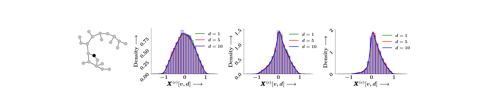
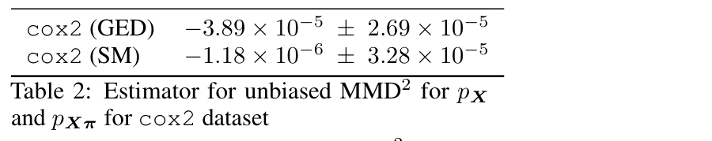
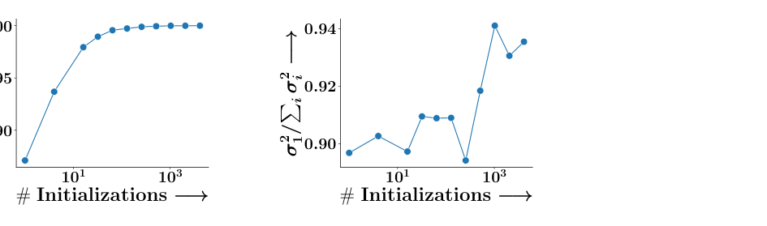
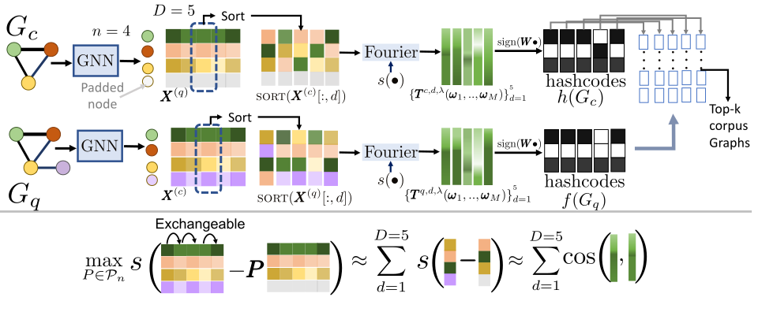
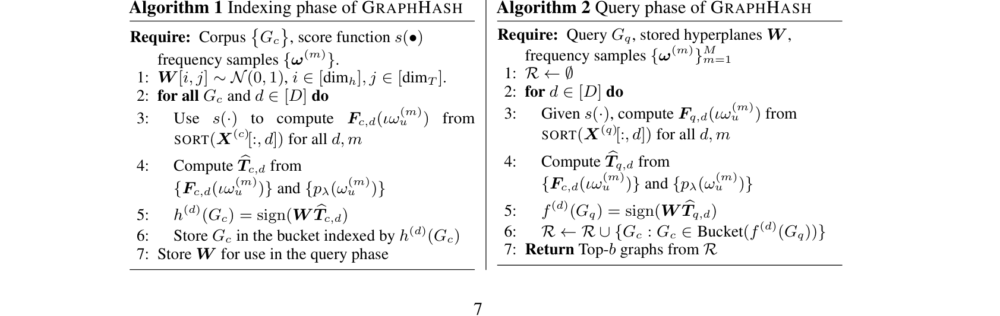
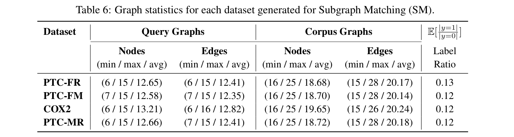
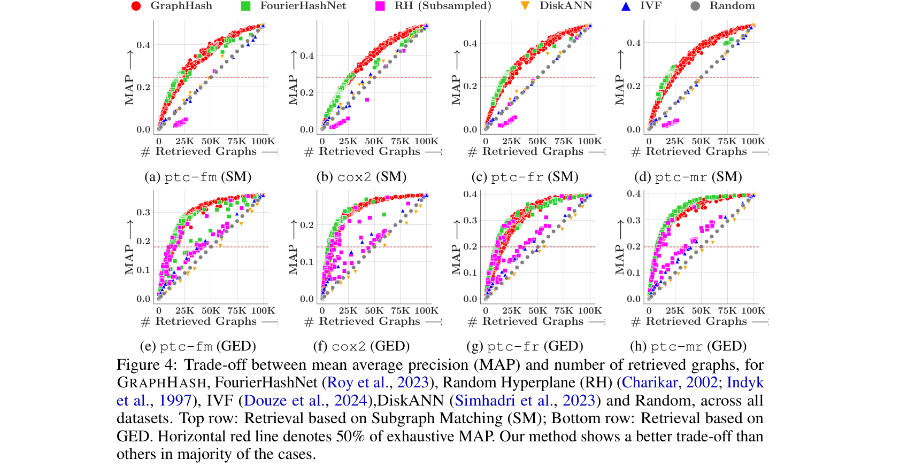
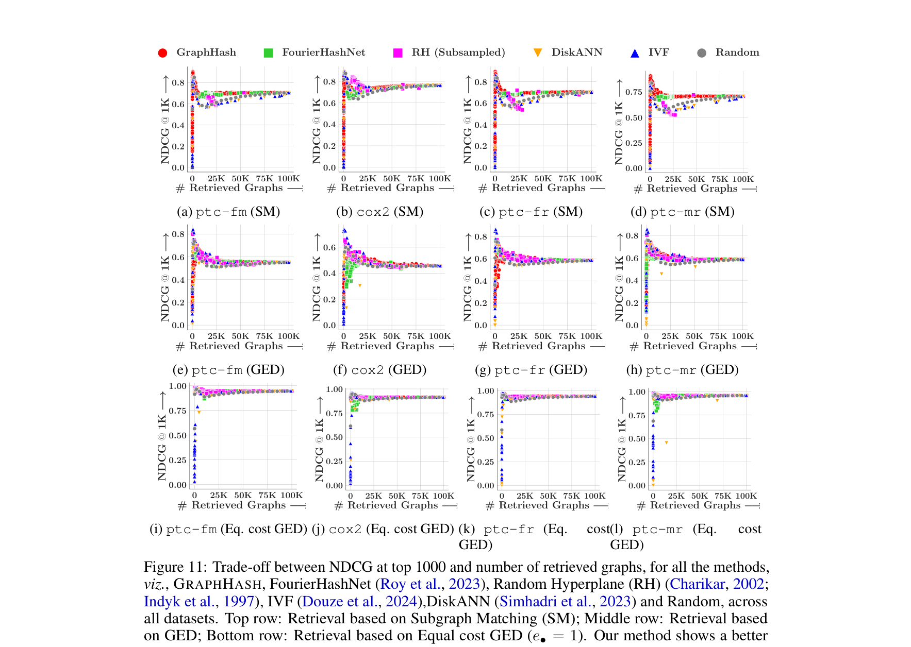

<!DOCTYPE html>
<html lang="en">
<head>
  <meta charset="utf-8">
  <meta http-equiv="X-UA-Compatible" content="IE=edge">
  <meta name="viewport" content="width=device-width, initial-scale=1, shrink-to-fit=no">
  <title>Exchangeability of GNN Representations with Applications to Graph Retrieval</title>

  <!-- Fonts: Fraunces (display serif) + Inter (body sans) + JetBrains Mono (code) -->
  <link rel="preconnect" href="https://fonts.googleapis.com">
  <link rel="preconnect" href="https://fonts.gstatic.com" crossorigin>
  <link href="https://fonts.googleapis.com/css2?family=Fraunces:opsz,wght@9..144,400;9..144,500;9..144,600;9..144,700&family=Inter:wght@400;500;600;700&family=JetBrains+Mono:wght@400;500&display=swap" rel="stylesheet">

  <!-- MathJax -->
  
  

  
</head>
<body>

<article>

  

    

      
        ICLR 2026
        <!-- 2026 -->
      
      
      
        ★
        Oral
      
    

    <h1 class="post-title">Exchangeability of GNN Representations  
      with Applications to Graph Retrieval</h1>

    

      <a class="primary" href="https://openreview.net/pdf?id=HQcCd0laFq">
        <svg viewBox="0 0 24 24" fill="none" stroke="currentColor" stroke-width="2"><path d="M14 2H6a2 2 0 0 0-2 2v16a2 2 0 0 0 2 2h12a2 2 0 0 0 2-2V8z"/><polyline points="14 2 14 8 20 8"/></svg>
        Paper
      </a>
      <a href="https://rebrand.ly/graphhash">
        <svg viewBox="0 0 24 24" fill="none" stroke="currentColor" stroke-width="2"><polyline points="16 18 22 12 16 6"/><polyline points="8 6 2 12 8 18"/></svg>
        Code
      </a>
      <a href="#contact">
        <svg viewBox="0 0 24 24" fill="none" stroke="currentColor" stroke-width="2"><path d="M4 4h16c1.1 0 2 .9 2 2v12c0 1.1-.9 2-2 2H4c-1.1 0-2-.9-2-2V6c0-1.1.9-2 2-2z"/><polyline points="22,6 12,13 2,6"/></svg>
        Contact
      </a>
    

    

      <strong>Kartik Nair</strong> (CMU),
      <strong>Indradyumna Roy</strong> (IIT Bombay),
      <strong>Soumen Chakrabarti</strong> (IIT Bombay), 
      <strong>Anirban Dasgupta</strong> (IIT Gandhinagar),
      <strong>Abir De</strong> (IIT Bombay)
    

  

  

    We discover a probabilistic symmetry hidden in trained graph neural networks: under standard initialization and
    training, the per-dimension components of node embeddings are <strong>exchangeable</strong> random variables.
    This single property collapses costly transportation-based graph similarity into a sorted-vector Euclidean
    similarity, giving the first unified locality-sensitive hashing framework for diverse graph retrieval tasks.
  

  <h2>Motivation</h2>
  

    Symmetries in neural networks have largely been studied <em>algebraically</em> — the invariance of an MLP's output
    under simultaneous permutations of its weight matrices, for instance. These symmetries are typically treated in
    isolation from the training process. We ask a different question: are there <em>probabilistic</em> symmetries
    that emerge naturally during the standard training of a GNN, induced by random initialization itself?
  

  

    The answer turns out to be yes — and the structure it exposes has direct, far-reaching consequences for scalable
    graph retrieval. Across a wide variety of message-passing architectures (GCN, GAT, GIN, gated GNN, graph transformers)
    and standard optimizers (SGD, Adam), the columns of the learned embedding matrix are exchangeable, where the randomness
    is induced by the model initialization.
  

  <h2>Problem Setup</h2>
  

    Given a graph $G = (V, E)$ with $|V| = n$, a graph neural network with parameters $\theta$ computes a node embedding
    matrix $X = [\mathbf{x}(u)]_{u \in [n]} \in \mathbb{R}^{n \times D}$, where $D$ is the embedding dimension. Parameters
    are initialized i.i.d. (e.g., Kaiming or Xavier) and trained by a gradient-based optimizer on a permutation-invariant loss.
  

  

    For graph retrieval, given a query graph $G_q$ and a corpus $\mathcal{C} = \{G_c\}$, we seek the top-$b$ corpus graphs
    most relevant to $G_q$. State-of-the-art relevance is captured by a unified transportation-based distance, decomposable
    across embedding dimensions:
  

  \[
    \Delta(G_c, G_q) = \min_{P \in \mathcal{P}_n} \sum_{u, u'} \sum_{d \in [D]} \rho\!\left(\mathbf{x}^{(q)}(u)[d] - \mathbf{x}^{(c)}(u')[d]\right) \cdot P[u, u'],
  \]
  

    where $\rho$ is convex and possibly asymmetric. Setting $\rho(\cdot) = [\cdot]_+$ recovers the hinge distance for
    subgraph isomorphism; $\rho(\cdot) = e_\ominus[\cdot]_+ + e_\oplus[-\cdot]_+$ recovers asymmetric graph edit distance.
    The catch: computing $\Delta$ exactly is $\mathcal{O}(n^3)$ and Sinkhorn approximations are $\mathcal{O}(n^2)$ —
    neither fits any standard index.
  

  <!-- 
· · ·
 -->

  <h2>Exchangeability of GNN Representations</h2>

  

    Before we use it, let us take a careful look at <em>what</em> exchangeability of GNN embeddings actually says, <em>why</em>
    it holds, and <em>how far</em> it travels. The story has three parts: a precise definition, a four-step argument that turns
    a property of i.i.d. initialization into a property of trained models, and a discussion of how restrictive the assumptions
    really are.
  

  <h3>What exchangeability says</h3>

  

    
Definition · Exchangeability (Aldous, 1985)

    

      Random vectors $Y_1, \dots, Y_D \in \mathbb{R}^n$ are <em>exchangeable</em> if for every permutation
      $\pi : [D] \to [D]$, the joint density satisfies
      $p_{Y_1, \dots, Y_D}(y_1, \dots, y_D) = p_{Y_{\pi(1)}, \dots, Y_{\pi(D)}}(y_1, \dots, y_D).$
      Reordering the indices does not change the joint distribution.
    

  

  

    For a trained GNN, the random vectors of interest are the <em>columns</em> of the embedding matrix $X = \text{GNN}_\theta(G) \in \mathbb{R}^{n \times D}$ —
    i.e., one $\mathbb{R}^n$ vector per embedding dimension. The randomness is induced by the random initialization of the
    parameters $\theta$. The claim is that these $D$ columns are exchangeable: shuffling them around does not change the
    joint distribution we get when we average over training runs with different seeds.
  

  

    Two things are worth pulling apart, because they are easy to conflate:
  

  

    

      
The intuition

      

        At initialization, all $D$ embedding dimensions are drawn from the same distribution. Training does not "break" this
        symmetry, because the loss does not care which dimension is which. So the dimensions remain interchangeable
        throughout training.
      

    

    

      
The formal claim

      

        $p(X) = p(X\pi)$ for every permutation matrix $\pi \in \mathcal{P}_D$. The randomness is over initializations,
        not over data. Two embedding dimensions are not the same vector — but their joint distribution is invariant
        under reordering.
      

    

  

  

    Two notes on what this is <strong>not</strong>. First, exchangeability does <em>not</em> say that two dimensions of
    the same trained model are equal. They are typically different vectors. It says that if you train many independent
    GNNs and look at the empirical density across runs, you get the same density for every dimension — and the same
    joint density for every reordering. Second, exchangeability is a <em>probabilistic</em> symmetry, distinct from
    the algebraic permutation symmetries of weight matrices that have been studied since Hecht-Nielsen (1990). Algebraic
    symmetry is about a single trained model; probabilistic symmetry is about the distribution of trained models.
  

 

  <h3>Why it holds — a four-step argument</h3>

  

    The core observation is simple, but turning it into a proof for arbitrary GNN architectures takes care. The argument
    in Section 3 of the paper has four steps. The first three are technical lemmas; the fourth is the main theorem.
  

  
<strong>Warm-up: a 2-layer MLP.</strong> Consider the map $\mathbf{x} = \sigma(\sigma(\text{feat}\cdot\Psi)\Theta)$.
    To reorder the columns of $\mathbf{x}$ by a permutation $\pi$, simply right-multiply $\Theta$ by $\pi$:
    $\Theta \mapsto \Theta\pi$ produces $\mathbf{x} \mapsto \mathbf{x}\pi$. The map
    $\Gamma_\pi(\theta) := \theta \cdot \mathrm{Diag}(I, \pi)$ is the parameter-side bijection that induces this
    output permutation. Because $\Theta$ is initialized i.i.d., $p(\Theta) = p(\Theta\pi)$, so
    $p(\mathbf{x}) = p(\mathbf{x}\pi)$ at $t = 0$. The whole argument extends this single observation through the
    full training trajectory of a GNN.
  

  

    

      
1

      

        <strong>Permutation-induced parameter transformation Lemma 2</strong>
        For any permutation $\pi$ on the embedding dimension axis, there exists a bijection $\Gamma_\pi$ on
        the GNN parameters $\theta$ such that $X\pi=$ GNN$_{\Gamma _{\pi} (\theta)}(G)$, with
        $|\det(\partial \Gamma_\pi(\theta) / \partial \theta)| = 1$. Constructing $\Gamma_\pi$ for a GNN is harder than for an MLP,
        because permutations propagate through neighborhood aggregation across layers. The lemma certifies it can be done for
        the architectures of interest (GCN, GAT, GIN, gated GNN, graph transformers).
      

    

    

      
2

      

        <strong>Gradient equivariance Lemma 3</strong>
        Because the loss is invariant under permutations of the embedding dimensions, it is invariant under $\Gamma_\pi$
        on the parameters: $\text{loss}(\Gamma_\pi(\theta)) = \text{loss}(\theta)$. Differentiating gives the gradient
        equivariance $\nabla_\theta \text{loss}\big|_{\Gamma_\pi(\theta)} = \Gamma_\pi\!\left(\nabla_\theta \text{loss}\big|_{\theta}\right)$.
        In words: shuffle the parameters, and the gradient shuffles in lockstep.
      

    

    

      
3

      

        <strong>Invariance of parameter density during training Lemma 4</strong>
        Combining initialization symmetry $p(\theta_0) = p(\Gamma_\pi(\theta_0))$ with gradient equivariance,
        the entire training trajectory is permutation-equivariant: if $\theta_0 \mapsto \Gamma_\pi(\theta_0)$, then
        $\theta_t \mapsto \Gamma_\pi(\theta_t)$ for all $t \geq 0$. The Jacobian-1 condition from Lemma 2 lets us
        push the symmetry through to densities: $p(\theta_t) = p(\Gamma_\pi(\theta_t))$ for every epoch.
      

    

    

      
4

      

        <strong>Exchangeability of embeddings Theorem 5</strong>
        Apply the GNN to the trained $\theta_t$. Since $X\pi = \text{GNN}_{\Gamma_\pi(\theta_t)}(G)$ and
        $\theta_t \stackrel{d}{=} \Gamma_\pi(\theta_t)$, we conclude $X \stackrel{d}{=} X\pi$, i.e. $p(X) = p(X\pi)$.
        Proposition 6 extends this to query–corpus pairs $Y = [X^{(q)}; X^{(c)}]$ when the loss is invariant under
        simultaneous permutation of both.
      

    

  

  

    The structure of the argument is general: any time you have (i) i.i.d. initialization, (ii) a loss invariant under
    a group action on intermediate representations, and (iii) a gradient-based optimizer, you get exchangeability
    of those representations under that group. GNNs are an instance of this template; CNNs and MLPs are others
    (independently noted in contemporaneous work).
  

  <h3>Three consequences worth pausing on</h3>

  

    The theorem is stated as a distributional statement, but it has concrete fingerprints that are useful both as
    sanity checks and as engineering tools. Each consequence below corresponds to a specific empirical test that
    the paper performs on the cox2 dataset, training 5,000 independent GNNs and looking at what the symmetry
    actually does in practice.
  

  <h4 style="font-family:'Fraunces',serif;font-weight:600;font-size:1.05rem;margin:32px 0 10px;color:var(--ink);">Consequence 1 — Identical marginals across embedding dimensions</h4>

  

    The most direct fingerprint: each component $\mathbf{x}(u)[d]$ should have the same marginal density across
    $d \in [D]$. To test this, the authors fix a corpus node $v$ in cox2, train 5,000 GNNs from scratch with
    different random seeds, and for each model record the scalar value $X^{(c)}[v, d]$ for $d \in \{1, 5, 10\}$.
    The histogram across seeds is the empirical density for that dimension. If exchangeability holds, these
    three histograms should overlap.
  

  <figure>
    
    <figcaption>
      <strong>Figure 2 (paper Fig. 1).</strong> Empirical probability density of $X^{(c)}[v, d]$ for the highlighted
      node $v$ in the example corpus graph $G_c$ in cox2, computed over 5,000 independently trained GNNs. Panels
      (b)–(d) show the density at three points in training: initialization, epoch 8, epoch 20. Across all three
      stages of training, the densities for $d = 1, 5, 10$ are visually indistinguishable — exchangeability is preserved
      throughout training, not just at initialization.
    </figcaption>
  </figure>

  <h4 style="font-family:'Fraunces',serif;font-weight:600;font-size:1.05rem;margin:32px 0 10px;color:var(--ink);">Consequence 2 — A direct distributional test via MMD</h4>

  

    Identical marginals are necessary but not sufficient for exchangeability — two different joint distributions
    can share marginals. The authors therefore run a stronger test: estimate the maximum mean discrepancy (MMD$^2$)
    between the empirical distribution of $X$ and that of $X\pi$ across 100 random permutations $\pi$. If the two
    distributions agree, MMD$^2$ should be near zero (and is allowed to go slightly negative, since the unbiased
    estimator can underestimate).
  

  <figure style="padding:32px 28px;">
    
    <figcaption>
      <strong>Table 2 (from the paper).</strong> Unbiased MMD$^2$ estimator between $p_X$ and $p_{X\pi}$ for the
      cox2 dataset, averaged over 100 random permutations. Both supervisions (GED and SM) yield estimates on the
      order of $10^{-5}$ or $10^{-6}$ — strong empirical support that $p_X$ and $p_{X\pi}$ coincide.
    </figcaption>
  </figure>

  <h4 style="font-family:'Fraunces',serif;font-weight:600;font-size:1.05rem;margin:32px 0 10px;color:var(--ink);">Consequence 3 — The expected embedding matrix is rank one</h4>

  

    A more surprising fingerprint follows from identical marginals plus exchangeability of joint columns:
    $\mathbb{E}[X]$ has all columns equal, so it is a <em>rank-one</em> matrix. To test this, compute the SVD
    of the empirical sample mean $\frac{1}{R}\sum_{r=1}^R X^{(r)}$ over $R$ independently trained models, and
    track the ratio $\sigma_1^2 / \sum_i \sigma_i^2$ — the fraction of total variance captured by the leading
    singular value. If $\mathbb{E}[X]$ truly is rank one, this ratio should converge to 1 as $R$ grows.
  

  <figure style="padding:32px 28px;">
    
    <figcaption>
      <strong>Figure 3 (from the paper).</strong> Relative size $\sigma_1^2 / \sum_i \sigma_i^2$ of the top singular
      value of the mean (trained) embedding matrix as a function of the number of independent initializations $R$,
      on cox2 under (a) Subgraph Matching and (b) GED supervision. As $R$ grows, the ratio approaches 1 from below,
      confirming that $\mathbb{E}[X]$ has rank 1. This is independently consistent with rank-collapse findings in
      transformers (Dong et al., 2023) and state-space models (Joseph et al., 2025).
    </figcaption>
  </figure>

  <h4 style="font-family:'Fraunces',serif;font-weight:600;font-size:1.05rem;margin:32px 0 10px;color:var(--ink);">Consequence 4 — Per-dimension scoring is unbiased (the engineering hook)</h4>

  

    The last consequence is what powers the GraphHash pipeline. Because dimensions are identically distributed,
    the score $\text{sim}_d(G_c, G_q)$ computed in any single dimension $d$ is an unbiased estimate (up to scaling)
    of the full $D$-dimensional transportation score. Aggregating per-dimension estimates therefore approximates
    the full cost. This is the formal hook that lets the next section replace optimal transport with sorting —
    a sublinear-time operation that fits cleanly into a locality-sensitive hash.
  

  <!-- <h3>How restrictive are the assumptions?</h3>

  

    The setting in Section 3.1 of the paper lists four conditions: (a) the GNN comes from a broad class of message-passing
    architectures, (b) parameters are initialized i.i.d. within each layer, (c) the loss is invariant to permutations
    of the embedding dimensions, and (d) the optimizer is gradient-based. It is fair to ask which of these is doing
    real work and which is for technical convenience.
  

  

    §
    <strong>Initialization.</strong> Standard Kaiming and Xavier schemes both satisfy (b). Block-diagonal or
    structured-sparse initializations would violate the i.i.d. requirement and are out of scope.
  

  

    §
    <strong>Loss permutation invariance.</strong> Many natural losses satisfy (c) for free. Pairwise ranking and
    binary cross-entropy losses computed from <em>transportation similarity</em> between embedding sets are invariant,
    because the transport plan does not care about dimension order. Dot-product link prediction
    $\mathbf{x}(u)^\top \mathbf{x}(v)$ is similarly invariant. Even when the loss is <em>not</em> invariant
    on its own, exchangeability can still hold under joint transformations of intermediate representations and
    subsequent-layer parameters (Appendix E.1.6 of the paper).
  

  

    §
    <strong>Architecture.</strong> The proof covers GCN, GAT, GIN, gated GNN, and graph transformers. Normalization
    layers (LayerNorm, BatchNorm) introduce no obstructions because they too act dimension-wise and equivariantly.
    The construction of $\Gamma_\pi$ is the architecture-dependent step; for any new architecture, this is the
    technical step to verify.
  

  

    §
    <strong>Optimizer.</strong> SGD and Adam are explicitly covered. The argument needs only that the update rule
    is permutation-equivariant; momentum and adaptive-rate schemes maintain this because they apply the same
    elementwise rule to every parameter coordinate.
  

  

    The takeaway: the conditions sound technical but capture the standard training pipeline almost exactly. If you
    are training a GNN on graph retrieval with PyTorch defaults, exchangeability holds.
  
 -->

  
· · ·

  <h2>The GraphHash Pipeline</h2>
  

    Our framework <strong>GraphHash</strong> turns the intractable transportation problem into a sequence of indexable
    operations, end to end:
  

  <figure>
      
    <!-- <figcaption>
      <strong>Figure 1: GraphHash pipeline.</strong> Exchangeability of embedding dimensions (highlighted block) is the
      pivot that makes the rest of the pipeline work — it justifies replacing high-dimensional optimal transport with
      one-dimensional sorted-vector similarity, which a standard random-Fourier-feature LSH can index in sublinear time.
    </figcaption> -->
  </figure>

  <h2>Core Components</h2>

  <h3>1Exchangeability of GNN Embeddings</h3>
  

    A sequence of random vectors $Y_1, \dots, Y_D \in \mathbb{R}^n$ is <em>exchangeable</em> if its joint density is invariant
    under any permutation of indices: $p(Y_1, \dots, Y_D) = p(Y_{\pi(1)}, \dots, Y_{\pi(D)})$ for all $\pi$. Our main result
    establishes exchangeability for the columns of the embedding matrix.
  

  

    
Theorem · Exchangeability of embedding elements

    
Under (i) i.i.d. initialization within each layer, (ii) a permutation-invariant loss, and (iii) a gradient-based
       optimizer (SGD, Adam, ...),

    \[ p(X) = p(X \pi) \quad \text{for all permutation matrices } \pi, \]
    
where the randomness is induced by the random initialization. The result extends to joint distributions over
       query–corpus pairs: with $Y = [X^{(q)}; X^{(c)}]$, $p(Y) = p(Y \pi)$.

  

  

    A direct consequence: the components $\mathbf{x}(u)[1], \dots, \mathbf{x}(u)[D]$ are <em>identically distributed</em>.
    Across many random seeds, the expected embedding matrix $\mathbb{E}\big[[\mathbf{x}(u)]_{u \in V}\big]$ collapses to
    a rank-one matrix — an observation aligned with recent rank-collapse findings in transformers and SSMs.
  

  <h3>2Transport → Sorted-Vector Euclidean Similarity</h3>
  

    Exchangeability implies the $D$ embedding coordinates are identically distributed, so each dimension yields a
    concentrated estimate of the full transportation similarity. Aggregating per-dimension estimates approximates the
    full $D$-dimensional cost. For a single dimension $d$, the transportation problem reduces to optimal transport
    between scalars — solved <em>exactly</em> by sorting:
  

  \[
    \mathrm{sim}_d(G_c, G_q) = s\!\left( \mathrm{SORT}(X^{(q)}[:, d]) \;-\; \mathrm{SORT}(X^{(c)}[:, d]) \right),
  \]
  

    where $s(\cdot) = \rho_{\max} - \rho(\cdot)$ is the corresponding score. A problem with no good index becomes
    a Euclidean similarity over fixed-length sorted vectors.
  

  <h3>3GraphHash: a unified LSH framework</h3>
  

    Once the score is Euclidean on sorted-embedding columns, classical LSH applies. Building on the Fourier-feature
    LSH construction of Roy et al. (2023), we embed order-statistics vectors via random Fourier features and bucket
    by sign:
  

<pre><code>// GraphHash: indexing a corpus graph G_c
X = GNN_θ(G_c)
for d in range(D):
    v_d   = SORT(X[:, d])              // per-dim order statistics
    φ_d   = fourier_features(v_d, ω)   // random Fourier projection
    h_d   = sign(φ_d @ R)              // sign hash
bucket(G_c) = concat(h_1, ..., h_D)</code></pre>

  

    We prove this is a valid LSH for the original transportation-based graph similarity, working uniformly across
    hinge similarity (subgraph matching), asymmetric GED, and other decomposable transportation distances. To our
    knowledge this is the first principled LSH for asymmetric transportation-based graph similarity.
  

  <figure>
    
    <figcaption>
      <strong>Figure 3 (from the paper).</strong> Algorithm 1 (left) precomputes hash codes for each corpus graph
      and stores them in buckets. Algorithm 2 (right) hashes the query graph the same way and returns the top-$b$
      graphs from the matching buckets — query time is sublinear in $|\mathcal{C}|$.
    </figcaption>
  </figure>

  
· · ·

  <h2>Experimental Findings</h2>

  

    The experimental section evaluates GraphHash on four real-world TU benchmark datasets, against five competitive
    indexing baselines, under two distinct supervision signals, and on two complementary retrieval metrics. The setup
    is summarised below; full details are in Section 5 of the paper.
  

  

    

      
Datasets

      
PTC-FR, PTC-FM, COX2, PTC-MR — 100K corpus graphs, 500 query graphs each

    

    

      
Supervision

      
Subgraph matching (VF2) and asymmetric GED ($e_\oplus = 1$, $e_\ominus = 2$)

    

    

      
Baselines

      
FourierHashNet, IVF, DiskANN, Random Hyperplane, Random

    

    

      
Metrics

      
MAP and NDCG vs. retrieval budget

    

  

  <figure>
    
    <figcaption>
      <strong>Table 1 (paper Table 6).</strong> Per-dataset statistics under Subgraph Matching supervision: query
      and corpus graph sizes (min / max / avg) and label ratio (fraction of relevant corpus graphs per query).
      Label ratios are between 12% and 13% across the four datasets, so retrieval is non-trivial — random sampling
      would recover relevant graphs only at that base rate. Statistics for the GED setting are similar.
    </figcaption>
  </figure>

  <h3>MAP vs. retrieval budget</h3>

  <figure>
    
    <figcaption>
      <strong>Figure 4 (from the paper).</strong> Trade-off between mean average precision (MAP) and number of
      retrieved graphs across all four TU-benchmark datasets. Top row: subgraph matching (SM); bottom row: GED.
      The horizontal red line denotes 50% of exhaustive MAP. <strong>GraphHash</strong> (red) consistently dominates
      all baselines across the accuracy-efficiency Pareto front, in many cases reaching the 50% line at one-third
      the candidate budget needed by the next-best method.
    </figcaption>
  </figure>

  <h3>Robustness across metrics and hyperparameters</h3>

  

    A single MAP curve can hide failure modes — a method might lift average precision while ranking the very best
    candidates poorly. To check for that, the paper repeats the comparison under NDCG, a position-sensitive metric,
    and adds a third supervision signal (equal-cost GED, where insertion and deletion costs are both 1).
  

  <figure>
    
    <figcaption>
      <strong>Figure 5 (paper Fig. 11, Appendix H.2).</strong> Trade-off between NDCG@1000 and number of retrieved
      graphs across all four datasets. Top row: subgraph matching; middle row: asymmetric GED ($e_\oplus = 1$,
      $e_\ominus = 2$); bottom row: equal-cost GED ($e_\oplus = e_\ominus = 1$). Every grid cell tells the same
      story as the MAP analysis — GraphHash dominates the curve, and the same hashing scheme transfers across
      supervision regimes without retuning.
    </figcaption>
  </figure>

  

    A second axis: the hashcode dimension $\dim_h$ controls the bit-budget of the LSH. Too few bits collapse
    everything into a single bucket; too many fragment the corpus and inflate the candidate set. The paper sweeps
    $\dim_h$ and tracks the area under the MAP-vs-budget curve (AUC) — a single scalar summarising the whole
    accuracy–efficiency trade-off.
  

 

 

  

    <h2>Contact</h2>
    
If you have questions or suggestions, please reach out to any of the authors.

    

      <a href="mailto:ksnair@cs.cmu.edu">✉ Kartik Nair</a>
      <a href="mailto:indraroy15@cse.iitb.ac.in">✉ Indradyumna Roy</a>
      <a href="mailto:soumen@cse.iitb.ac.in">✉ Soumen Chakrabarti</a>
      <a href="mailto:anirbandg@iitgn.ac.in">✉ Anirban Dasgupta</a>
      <a href="mailto:abir@cse.iitb.ac.in">✉ Abir De</a>
    

  

</article>

<footer>
  
©KN/IR/ADG/SC/AD. Built with help of Claude. <a href="https://openreview.net/pdf?id=HQcCd0laFq" style="color: var(--muted);">read the paper</a>

</footer>

</body>
</html>
